# Demo Kullanıcı Listesi ve Şirket Simülasyonu

Bu doküman, **Yapay Zeka Destekli Bireysel Çalışan Gelişim Öneri Sistemi** projesinde kullanılmak üzere tasarlanmış simüle şirket kadrosunu içermektedir. Şirket yapısı **5 ana departman** altında **3 normal çalışan ve 1 departman yöneticisi** olmak üzere toplam **20 çalışan** olarak kurulmuştur.

Bu veriler hem frontend mock veri tabanında (LocalStorage) testler için hem de gerçek veritabanı (Database SQL/NoSQL tohumlamaları) için kullanılabilir.

---

## 1. Departmanlara Göre Hiyerarşik Dağılım

```mermaid
graph TD
    %% Human Resources
    Ahmet[Ahmet Yılmaz <br> HR Manager] --> Buse[Buse Demir <br> HR Specialist]
    Ahmet --> Cem[Cem Aydın <br> Recruiter]
    Ahmet --> Deniz[Deniz Yıldız <br> HR Specialist]

    %% Technology
    Zeynep[Zeynep Arslan <br> Engineering Manager] --> Emre[Emre Koç <br> Software Engineer]
    Zeynep --> Elif[Elif Şen <br> Senior Software Engineer]
    Zeynep --> Fatih[Fatih Kaya <br> Data Scientist]

    %% Sales & Marketing
    HakanC[Hakan Çelik <br> Sales Executive] --> Gizem[Gizem Öztürk <br> Sales Representative]
    HakanC --> HakanY[Hakan Yılmaz <br> Account Manager]
    HakanC --> Irem[İrem Aslan <br> Marketing Specialist]

    %% Finance & Accounting
    Kemal[Kemal Şahin <br> Finance Manager] --> Lale[Lale Bulut <br> Accountant]
    Kemal --> Murat[Murat Güler <br> Financial Analyst]
    Kemal --> Nalan[Nalan Demir <br> Payroll Specialist]

    %% Operations
    Orhan[Orhan Yalçın <br> Operations Manager] --> Pinar[Pınar Tekin <br> Operations Specialist]
    Orhan --> Riza[Rıza Mutlu <br> Logistics Coordinator]
    Orhan --> Selin[Selin Yılmaz <br> Production Engineer]

    %% Styles
    classDef mgr fill:#1e293b,stroke:#3b82f6,stroke-width:2px,color:#fff;
    classDef emp fill:#0f172a,stroke:#475569,stroke-width:1px,color:#cbd5e1;
    class Ahmet,Zeynep,HakanC,Kemal,Orhan mgr;
    class Buse,Cem,Deniz,Emre,Elif,Fatih,Gizem,HakanY,Irem,Lale,Murat,Nalan,Pinar,Riza,Selin emp;
```

---

## 2. Kullanıcı Listesi Tablosu

| ID | Kod | Ad Soyad | E-posta | Departman | Rol | Yönetici ID | Cinsiyet | Yaş | Performans |
|---|---|---|---|---|---|---|---|---|---|
| **1** | EMP001 | Ahmet Yılmaz | `ahmet.yilmaz@demo.com` | Human Resources | HR Manager | *Yok (Manager)* | Erkek | 42 | 4.2 |
| **2** | EMP002 | Buse Demir | `buse.demir@demo.com` | Human Resources | HR Specialist | 1 | Kadın | 27 | 3.8 |
| **3** | EMP003 | Cem Aydın | `cem.aydin@demo.com` | Human Resources | Recruiter | 1 | Erkek | 31 | 3.9 |
| **4** | EMP004 | Deniz Yıldız | `deniz.yildiz@demo.com` | Human Resources | HR Specialist | 1 | Kadın | 29 | 3.5 |
| **5** | EMP005 | Zeynep Arslan | `zeynep.arslan@demo.com` | Technology | Engineering Manager | *Yok (Manager)* | Kadın | 39 | 4.5 |
| **6** | EMP006 | Emre Koç | `emre.koc@demo.com` | Technology | Software Engineer | 5 | Erkek | 26 | 3.6 |
| **7** | EMP007 | Elif Şen | `elif.sen@demo.com` | Technology | Senior Software Engineer | 5 | Kadın | 34 | 4.1 |
| **8** | EMP008 | Fatih Kaya | `fatih.kaya@demo.com` | Technology | Data Scientist | 5 | Erkek | 30 | 3.9 |
| **9** | EMP009 | Hakan Çelik | `hakan.celik@demo.com` | Sales & Marketing | Sales Executive | *Yok (Manager)* | Erkek | 45 | 4.0 |
| **10** | EMP010 | Gizem Öztürk | `gizem.ozturk@demo.com` | Sales & Marketing | Sales Representative | 9 | Kadın | 28 | 3.7 |
| **11** | EMP011 | Hakan Yılmaz | `hakan.yilmaz@demo.com` | Sales & Marketing | Account Manager | 9 | Erkek | 35 | 3.9 |
| **12** | EMP012 | İrem Aslan | `irem.aslan@demo.com` | Sales & Marketing | Marketing Specialist | 9 | Kadın | 32 | 4.1 |
| **13** | EMP013 | Kemal Şahin | `kemal.sahin@demo.com` | Finance & Accounting | Finance Manager | *Yok (Manager)* | Erkek | 48 | 4.4 |
| **14** | EMP014 | Lale Bulut | `lale.bulut@demo.com` | Finance & Accounting | Accountant | 13 | Kadın | 33 | 3.8 |
| **15** | EMP015 | Murat Güler | `murat.guler@demo.com` | Finance & Accounting | Financial Analyst | 13 | Erkek | 29 | 4.0 |
| **16** | EMP016 | Nalan Demir | `nalan.demir@demo.com` | Finance & Accounting | Payroll Specialist | 13 | Kadın | 36 | 3.7 |
| **17** | EMP017 | Orhan Yalçın | `orhan.yalcin@demo.com` | Operations | Operations Manager | *Yok (Manager)* | Erkek | 44 | 4.3 |
| **18** | EMP018 | Pınar Tekin | `pinar.tekin@demo.com` | Operations | Operations Specialist | 17 | Kadın | 28 | 3.6 |
| **19** | EMP019 | Rıza Mutlu | `riza.mutlu@demo.com` | Operations | Logistics Coordinator | 17 | Erkek | 37 | 3.9 |
| **20** | EMP020 | Selin Yılmaz | `selin.yilmaz@demo.com` | Operations | Production Engineer | 17 | Kadın | 31 | 4.0 |

---

## 3. Giriş ve Oturum Bilgileri

Sistem genelinde hem frontend test ortamında (Mock API) hem de canlı backend veritabanında aşağıdaki giriş bilgileri tanımlanmıştır:

* **Sistem Yöneticisi (Admin):**
  * E-posta: `admin@demo.com`
  * Şifre: `Admin1234!`
  * **Önemli Yetki:** Sistem veritabanındaki tüm tabloları sıfırlayarak (truncate/delete) bu dökümanda yer alan 20 kişilik simüle şirket verilerini (tohum verilerini) yeniden yükleme yetkisine sahiptir.
* **İnsan Kaynakları (HR):**
  * E-posta: `hr@demo.com`
  * Şifre: `Hr1234!`
  * **Yetki:** Şirketteki tüm çalışanların gelişim aksiyon planlarını, anket atamalarını ve 360° değerlendirmeleri yönetebilir.
* **Simüle Çalışanlar (Employees & Managers):**
  * E-postalar: Yukarıdaki tabloda yer alan e-posta adresleri (Örn: `zeynep.arslan@demo.com`, `emre.koc@demo.com`).
  * Varsayılan Şifre: `Demo1234!` (Canlı modda tüm çalışanlar bu şifreyle tohumlanacaktır).

---

## 4. Veritabanı Seed Planı (Backend Geliştirici İçin)

Backend tarafında test ortamını tohumlamak için `demo_users.json` verisi veritabanına aktarılmalıdır. 
* **Temizlik ve Yeniden Tohumlama:** Admin hesabı ile giriş yapıldığında tetiklenecek olan veritabanı sıfırlama işlemi; sırasıyla `Tasks`, `ActionPlans`, `AssessmentAssignments`, `AssessmentScores`, `Assessments` ve `Employees` tablolarını boşaltıp, `Employees` tablosuna bu dökümandaki 20 kişiyi yeniden eklemelidir.

